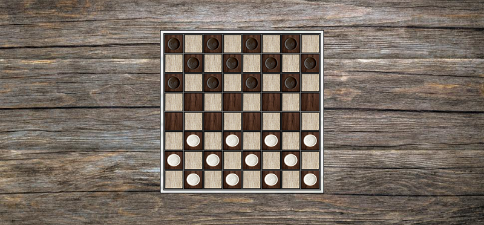
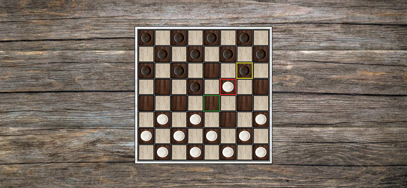
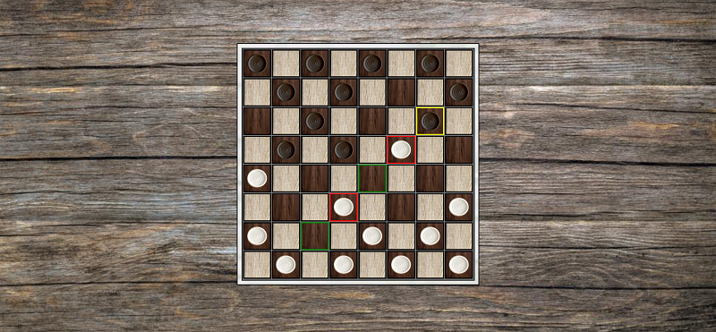
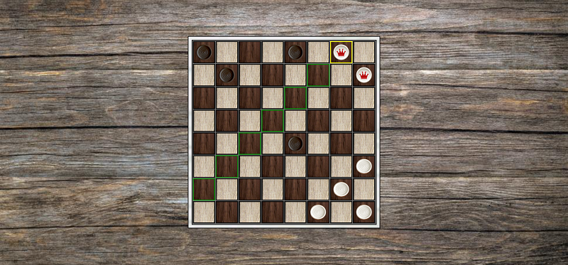
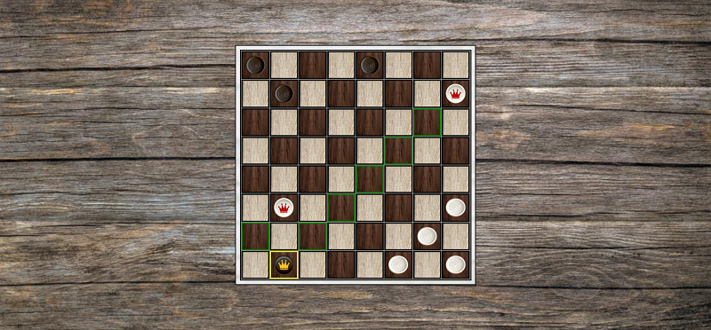

# JOGO DE DAMAS
👨‍🏫JOGO EM HTML/CSS/JS.

   
   
  
  
  

## DESCRIÇÃO:
Este é um jogo de Damas que roda em um navegador. Ao carregar a página, o jogo gera automaticamente um tabuleiro 8x8 e coloca as peças nas posições iniciais, com as peças claras embaixo e as escuras em cima.

## REGRAS DO JOGO:
1. **Movimentação**: As peças só podem se mover para frente, exceto quando há uma peça adversária logo atrás, permitindo o movimento para trás para capturá-la.
2. **Captura Obrigatória**: Se uma captura estiver disponível, o jogador deve fazê-la, e em caso de múltiplas capturas possíveis, deve capturar o maior número possível de peças adversárias.
3. **Rainha**: Ao atingir a última linha do lado adversário, a peça se torna uma "Rainha", ganhando o direito de se mover em qualquer direção nas diagonais, tanto para frente quanto para trás.

## COMO JOGAR?
- **Movimento**: Clique na peça que deseja mover. Se a peça pode se mover, as possíveis casas de destino ficam verdes. Se for uma Rainha, as opções de movimento são mais amplas.
- **Captura**: Se uma peça adversária estiver vulnerável, o jogo obriga a captura, marcando as peças capturáveis em vermelho.
- **Troca de Turno**: Após cada jogada, a vez passa para o jogador adversário, a menos que haja uma sequência de capturas obrigatórias.

## GANHANDO O JOGO:
O jogo continua até que um jogador capture todas as peças do adversário ou bloqueie todos os movimentos possíveis, forçando a vitória.

Este jogo implementa várias regras clássicas e algumas funcionalidades automáticas para melhorar a experiência, como a promoção automática a Rainha e a exigência de capturas múltiplas quando disponíveis.

## NÃO SABE?
- Entendemos que para manipular arquivos em `HTML`, `CSS` e outras linguagens relacionadas, é necessário possuir conhecimento nessas áreas. Para auxiliar nesse aprendizado, oferecemos cursos gratuitos disponíveis:
* [CURSO DE HTML E CSS](https://github.com/VILHALVA/CURSO-DE-HTML-E-CSS)
* [CURSO DE JAVASCRIPT](https://github.com/VILHALVA/CURSO-DE-JAVASCRIPT)
* [CONFIRA MAIS CURSOS](https://github.com/VILHALVA?tab=repositories&q=+topic:CURSO)

## CREDITOS:
- [PROJETO CRIADO PELO "HercoZauZau"](https://github.com/HercoZauZau/JogoDeDamas)
- [PROJETO EDITADO PELO VILHALVA](https://github.com/VILHALVA)
